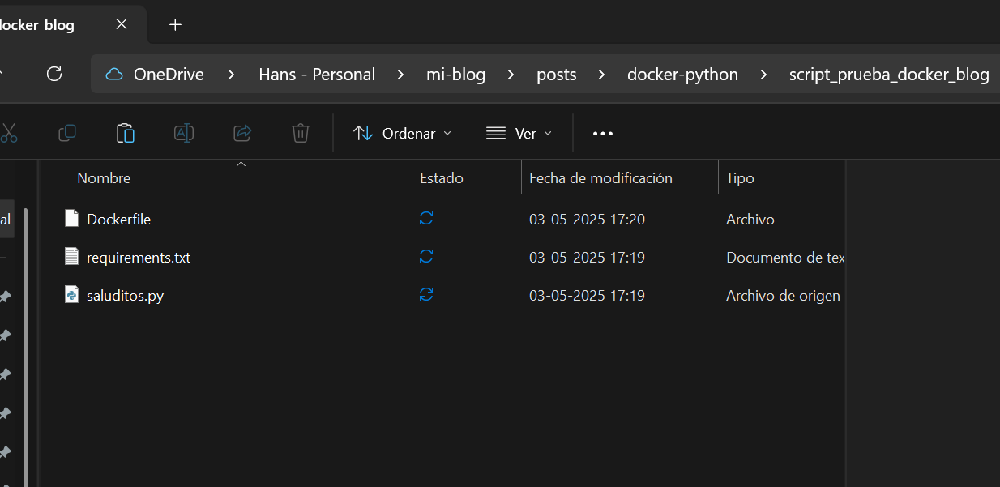
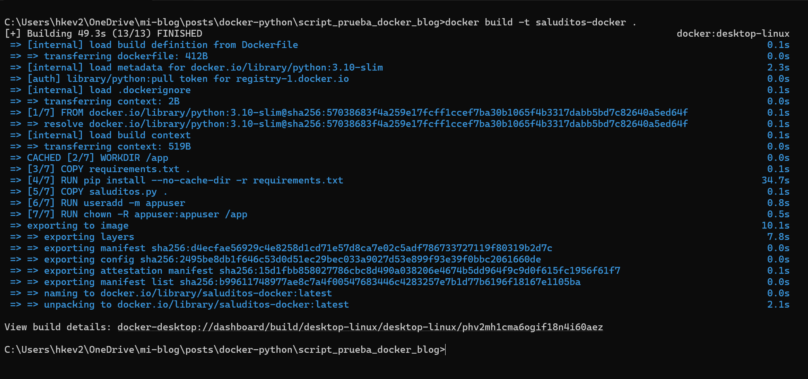
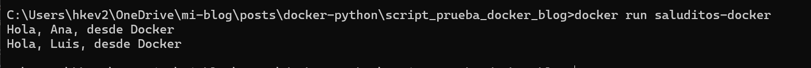
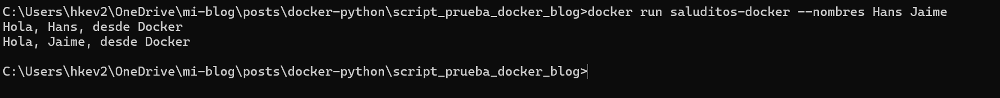
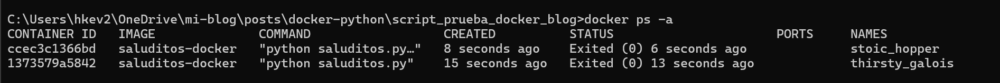

¡Qué tal, gente! Hoy quiero contarles una pequeña historia de supervivencia académica. Si alguna vez han estado en el infierno de la tesis, seguramente me entienden.
Ahí estaba yo, con mi laptop echando humo como locomotora antigua cada vez que intentaba ejecutar esos modelitos de machine learning que tanto dolor de cabeza me causan. 
La pobre máquina me suplicaba "¡Déjame vivir!" mientras yo esperaba horas y HORAS para ver resultados. Una pesadilla.
Hasta que un día dije: ¡BASTA! Mi laptop merece mejor vida y yo necesito conservar lo poco que queda de mi salud mental. 
Fue cuando descubrí mi salvación: Docker + la nube.
¿Docker? Sí, esa cosa de la que todos hablan en tech pero que suena intimidante al principio. 
Resulta que no es tan complicado y se ha convertido en mi mejor aliado.

En este apartado, me gustaría explicarles un poco sobre Docker, cómo subir sus scripts y cómo ejecutarlos.

## ¿Por qué Docker?

Básicamente, Docker me permite empaquetar todo mi código y sus dependencias en un contenedor bien bonito que puedo enviar a la nube como quien manda un paquete 
por correo. "¡Hey, nube! Aquí te va este proceso pesadísimo, ejecútalo tú mientras yo veo Netflix, ¿va?".

Lo mejor es que:

Mi laptop ya no suena como avión despegando
Puedo seguir usando mi computadora para otras cosas mientras los procesos corren en la nube
No tengo que preocuparme por "en mi máquina sí funciona" porque Docker garantiza que todo se ejecute igual donde sea

Ahora explicaré cómo normalmente suelo hacerlo 

---

1) Organizar mi caos: Necesito 3 archvos principales, mi script de python (script.py); mi archivo de dependencias (requirements.txt) 
que necesita mi script para funcionar; y mi archivo Dockerfile (es la configuración adecuada para que mi script se ejecute adecuadamente)

2) Construir mi "paquete mágico": Con un par de comandos, levanto todo en un contenedor de docker listo para ser ejecutado.

3) Correr: Finalmente, solo lo ejecuto, y ¡Plum!, maravilla, ya está!

---

Les explicaré cada paso detalladamente con un ejemplo bastante sencillo

## ¡¡Empecemos!!

Primero y antes que nada, necesitamos nuestro script, ya sea de una función o de una aplicación que queramos ejecutar, en mi caso, solo será 
un script sencillo que dice hola desde docker, lo llamaremos "saluditos.py".


```{python}
#| eval: false

import pandas as pd
import argparse

def lambda_handler(event=None, context=None):
    if event and "nombres" in event:
        nombres = event["nombres"]
    else:
        nombres = ['Ana', 'Luis']

    df = pd.DataFrame({'Nombre': nombres})
    saludos = [f"Hola, {nombre}, desde Docker" for nombre in df['Nombre']]

    for saludo in saludos:
        print(saludo)

    return {
        'statusCode': 200,
        'body': saludos
    }

if __name__ == '__main__':

    parser = argparse.ArgumentParser()
    parser.add_argument('--nombres', nargs='*', help='Lista de nombres', default=None)
    args = parser.parse_args()

    event = {"nombres": args.nombres} if args.nombres else None
    lambda_handler(event)

```

Ya teniendo nuestro código (En este apartado no voy a explicar qué significa cada detalle del código); ahora debemos crear dos archivos más, 
un archivo donde estén todas las librerias que necesitaremos para el correcto funcionamiento del script, y lo llamaremos "requirements.txt"; y el otro 
archivo lo llamaremos "Dockerfile" (sin extensión) donde pondremos la configuración adecuada para que el código se ejecute en Docker.

El archivo requirements.txt, en mi caso, sería lo siguiente:

```{python}
#| eval: false
pandas
argparse
```

y el Dockerfile es el siguiente: 

```dockerfile
FROM python:3.10-slim

WORKDIR /app

# Copiar e instalar requisitos
COPY requirements.txt .
RUN pip install --no-cache-dir -r requirements.txt

# Copiar script
COPY saluditos.py .

# Ejecutar como usuario no root para mejor seguridad
RUN useradd -m appuser
RUN chown -R appuser:appuser /app
USER appuser

# Ejecutar el script
ENTRYPOINT ["python", "saluditos.py"]
```

Tu carpeta debería quedar algo como:



Ahora, ya teniendo tu archivo Dockerfile (Sí tiene que llamarse así, sin ninguna extensión, y tenerlo en la misma carpeta de tu script), pasaremos a 
abrir docker (el programa - Docker Desktop); cualquier cosa, pueden descargarlo en [este enlace](https://www.docker.com/).

Después, pasamos a abrir nuestro terminal, pero recuerda que el terminal debes abrirlo desde la misma carpeta donde están tus archivos
Una manera sencilla de hacerlo, y que me gusta mucho, es la siguiente:

<video width="100%" controls>
  <source src="videos/abriendo-terminal.mp4" type="video/mp4">
</video>


Ya teniendo abierto el docker, y tu terminal, pasaremos a ejecutar las siguiente lineas de comandos.

```{python}
#| eval: false
docker build -t saluditos-docker .
```

Esto permitirá levantar el docker, ahora puedes abrir tu docker y deberías ver algo como:



Y ahora para ejecutarlo, es algo tan sencillo como:

```{python}
#| eval: false
docker run saluditos-docker
```
Obtendrías algo como: 



Sin embargo, me dirás..!Hans, mi función recibe parámetros! ¿cómo hago si quiero pasarle?
Pues izi! usamos los siguientes comandos:

```{python}
#| eval: false
docker run saluditos-docker --nombres Hans Jaime
```
Este comando nos permite agregar los argumentos en nuestro script.

y obtenemos algo como:



Ahora, si eres cuidadoso, podrás observar en mi Dockerfile un detalle: en muchos otros blogs, en la última parte encontrarás solo "CMD[python, "script.py"]"; sin embargo,
en mi caso puse ENTRYPOINT, este comando me permite agregar como argumento lo que sea que venga después.
  
Ahora, resulta lo siguiente, nosotros ya ejecutamos nuestro script desde docker, y ya finalizó y lo podemos verificar desde 

```{python}
#| eval: false
docker ps -a
```
esto nos mostrará todos los contenedores que se están ejecutando o que se ejecutaron en el sistema.



Sin embargo, a pesar de estar como "Exited"; siguen ocupando un espacio en el sistema, por lo que es recomendable "eliminarlos"

Si queremos eliminar todos los contenedores, usamos:

```{python}
#| eval: false
docker container prune
```

ahora, si queremos eliminar uno en específico, también podemos usar el comando "rm" agregado del ID del contenedor, que lo obtuvimos al hacer docker ps -a anteriormente;
en mi caso sería lo siguiente

```{python}
#| eval: false
docker rm db2db69bccd0
```

después de esto, si verificamos con docker ps -a; ya no tenemos contenedores cargados en nuestro sistema!!


¡Y eso es todo, amigos!

¿Ven qué fácil es? Con estos sencillos pasos, acabo de liberar a mi laptop de años de tortura. Si yo pude hacerlo en medio del caos de mi tesis, créanme que ustedes también pueden.
Un pequeño consejo extra: no se olviden de ese comando docker container prune después de terminar. Es como limpiar la cocina después de preparar un festín—nadie quiere hacerlo, pero todos agradecemos el espacio libre después.
Mi nuevo flujo de trabajo es simple: preparar mi script, empaquetarlo en Docker, enviarlo a la nube y... 
¡a disfrutar de la vida mientras las máquinas trabajan por mí! La semana pasada dejé corriendo un modelo durante 12 horas mientras me fui a pasear por ahí.
 ¿El resultado? Datos analizados y recuerdos creados. ¡Win-win!
Si les sirvió este tutorial o tienen alguna duda, déjenme un correo o algo. Y si tienen algún truco para mejorar este proceso, ¡compártanlo! 
Todos estamos aprendiendo en este viaje.

En otro apartado, les explicaré cómo subir su contenedor a la nube.

¡Hasta la próxima!