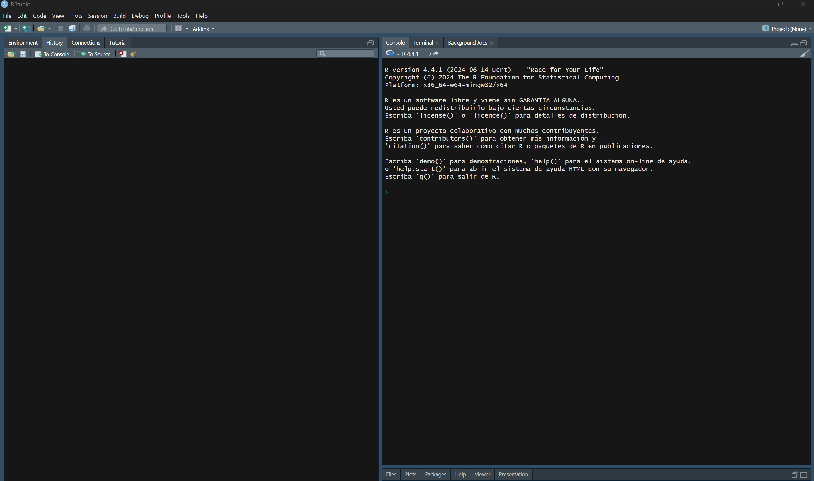
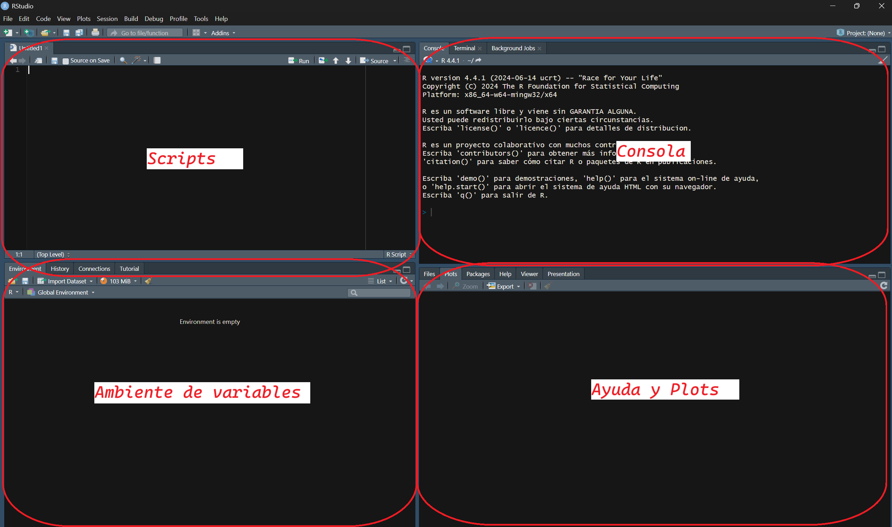

## 🧪 Mi primer script en R

Recuerdo clarito el primer script que escribí en R. Tenía como tres líneas y aún así me sentía un hacker de película. 
No entendía casi nada, pero ver que el código hacía algo fue mágico.
¿Estás empezando con R y no sabes por dónde comenzar? Tranqui, todos hemos pasado por esa etapa de "¿qué rayos estoy haciendo?". 
En este post te guiaré desde cero para que puedas escribir tu primer script en R y empezar tu camino en el fascinante mundo del análisis de datos.

## ¿Por qué R?

Antes de meternos en código, déjame contarte por qué R es genial:

Es gratis y open source (tu bolsillo te lo agradecerá)
Tiene una comunidad enorme dispuesta a ayudar
Es especializado en estadística y visualización (esas gráficas bonitas que ves en papers científicos, probablemente fueron hechas en R)
Tiene más de 18,000 paquetes para casi cualquier cosa que imagines


## Instalando lo necesario

Primero, necesitas dos cosas:

R - el lenguaje de programación en sí
RStudio - un entorno de desarrollo que hace que usar R sea muuucho más fácil

Descarga R desde [CRAN](https://cran.r-project.org/) y [RStudio](https://posit.co/download/rstudio-desktop/) desde su sitio oficial. 
La instalación es bastante directa, como cualquier otro programa.
Abriendo RStudio por primera vez

Cuando abras RStudio, verás algo como esto:



El siguiente paso es abrir un script con el comando Ctrl + Shift + N o de la siguiente manera: 


de manera sencilla, Rstudio te ayuda a ordenarte en 4 componentes principales "Scripts", "Consola", "Ambiente de Variables", "Ayuda-plots"; se visualiza en el siguiente
gráfico:



Los comandos podemos escribirlos, tanto en la consola, como en la zona de los scripts, la diferencia es que, la consola es como si fuera un borrador,
puedes poner lo que deseas, pero no tendrás la opción de guardarlo; por otro lado, en la zona de los scripts, tienes la opción de guardar las líneas de código
que deseas, sería algo así como, en la consola haces todas las pruebas que deseas hasta encontrar el código que te sirve, y ese código, lo pasas al script para poder
guardarlo luego.

## Tu primer "Hola Mundo" en R

Vamos a empezar con algo súper simple. En la consola, escribe:

``` {r}
#| eval: false

print("¡Hola, mundo del análisis de datos!")
```
Presiona Enter y... ¡BOOM! Acabas de ejecutar tu primer comando en R. No es gran cosa, pero es un comienzo, ¿no?

## Creando tu primer script
Hasta ahora, solo hemos escrito comandos directamente en la consola. Pero lo profesional es crear scripts que puedas guardar y reutilizar. Para eso,
como mencionamos, usaremos la zona de "Scripts".

En el script podemos escribir lo siguiente:

```{r}
#| eval: false

# Mi primer script en R

# Crear algunas variables
mi_numero <- 42
mi_texto <- "La respuesta a todo"

# Mostrar los valores
print(mi_numero)
print(mi_texto)

# Un cálculo simple
resultado <- mi_numero * 2
print(paste("El doble de mi número es:", resultado))

# Crear un vector (algo así como una lista de valores)
mis_datos <- c(15, 23, 36, 42, 58, 71)

# Calcular estadísticas básicas
print(paste("Promedio:", mean(mis_datos)))
print(paste("Valor mínimo:", min(mis_datos)))
print(paste("Valor máximo:", max(mis_datos)))

```
Ahora, para poder guardaro tu script, podemos usar: Ctrl+S; y podemos ponerle un nombre como "mi_primer_script.R".

Para ejecutar todo el script, selecciona todo el código (Ctrl+A) y presiona Ctrl+Enter.

¡WOW! ¿Viste eso?

## ¿Y ahora qué?

Este es solo el comienzo de tu viaje con R. 

Algunas cosas que podrías explorar después:

---

- Visualización de datos con ggplot
- Importar datos desde CSV, Excel o bases de datos
- Limpiar y transformar datos con el paquete dplyr
- Crear visualizaciones interactivas con plotly
- Hacer análisis estadísticos más avanzados
- Crear reportes automáticos con R Markdown

---


## Consejos para principiantes

Los errores son normales: Todos cometemos errores. Lee los mensajes de error, suelen darte pistas sobre cómo solucionarlos.
Google es tu amigo: Si te atascas, busca en Google. Alguien ya ha tenido el mismo problema que tú.
Stack Overflow será tu biblia: Es el sitio de referencia para resolver dudas de programación.
Comenta tu código: Los comentarios (líneas que comienzan con #) te ayudarán a entender lo que hiciste cuando regreses a tu código meses después.
Practica, practica, practica: La única forma de aprender es haciendo.
Obviamente, usa la IA, pero úsala de manera adecuada, si realmente quieres aprender a programar, entonces, entiende lo que estás escribiendo en tus códigos!!!!!!!

## Conclusión

¿Ves? No era tan difícil escribir tu primer script en R. Lo más importante es perder el miedo y comenzar. Recuerda que todos fuimos principiantes alguna vez, 
y que la comunidad de R es muy amigable y está dispuesta a ayudar.
Ahora es tu turno: ¿Qué fue lo primero que intentaste hacer con R? ¿Tienes alguna duda específica? ¡Déjame un comentario y conversemos!
P.D: Aún recuerdo la emoción cuando logré hacer mi primer gráfico en R... fue un gráfico pie!! jajaja sí!.
y también recuerdo haber perdido horas de mi vida buscando errores que fueron solo por un punto "." o una coma "," 🤦‍♂️; leer los mensajes de error que te da R
ayudan mucho, créanme, equivocarse
es lo mejor que puedes hacer en esta etapa, porque de ahí se aprende.
