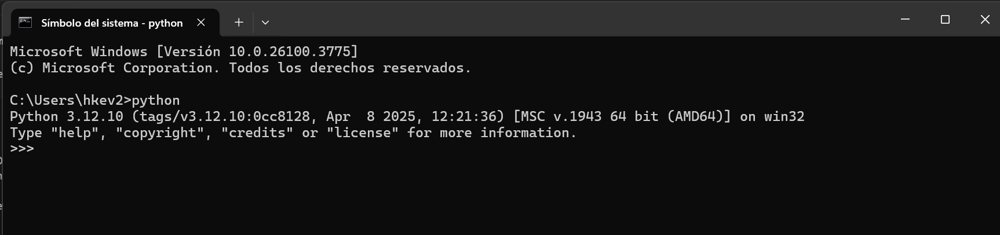
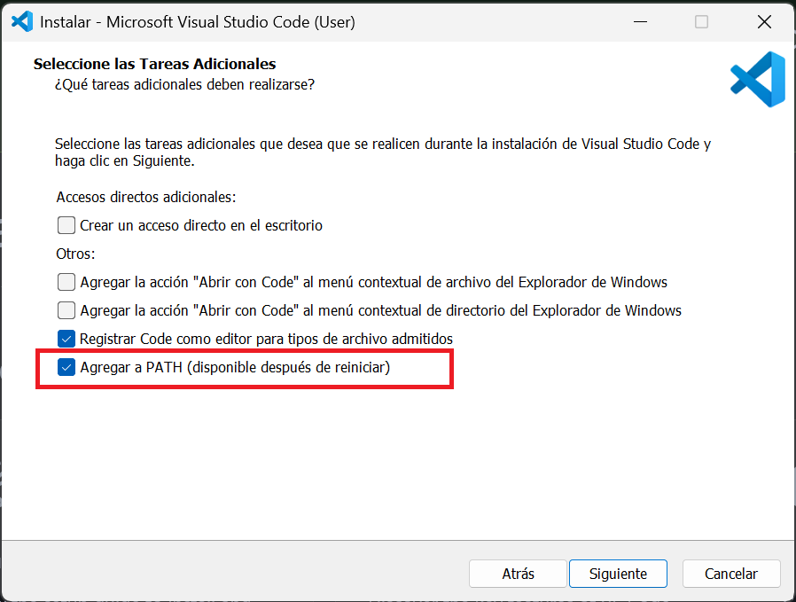

## ¿Por qué Python?

Porque es fácil de leer, fácil de escribir y muy poderoso. Es uno de los lenguajes de programación más populares del mundo, y no es por casualidad. 
Con Python puedes hacer de todo: desde análisis de datos, inteligencia artificial, automatización de tareas, hasta videojuegos y apps web. 
Además, su comunidad es enorme, así que siempre habrá alguien que ya pasó por el mismo error que tú.

## Instalando Python y un editor de texto

Python: ve a la página oficial de [python](https://www.python.org/) y descarga la última versión.

Una vez instalado, puedes verificar que está instalando al ejecutar "python" desde el terminal:



Para este tutorial, usaremos Visual Studio Code (VSC), que lo puedes descargar desde su página oficial [aquí](https://code.visualstudio.com/).

Cuando lo estés instalando, asegúrate de marcar la casilla que dice "Agregar a PATH" (Add Python to PATH) cuando lo instales.



## Tu primer “Hola Mundo”

Abre VS Code, crea un archivo llamado "saludos.py" y escribe esto:

```{python}
#| eval: false

print("Hola mundo")

```

Guarda y luego ejecútalo. Si estás en VS Code, puedes presionar Ctrl + ñ para abrir la terminal y luego escribir:


```{python}
#| eval: false

python saludos.py

```

Y verás tu primer mensaje en la consola. 🎉 Acá te dejo un video corto con los pasos a seguir, es muy fácil!!:

<video width="100%" controls>
  <source src="videos/creando-tu-script-python.mp4" type="video/mp4">
</video>

## Variables, cálculos y listas

Siguiendo los mismos pasos, intenta correr el siguiente script!!

```{python}
#| eval: false

# Variables
nombre = "Ash"
edad = 12

# Cálculos
siguiente_anio = edad + 1

# Listas
amigos = ["Ana", "Luis", "Sofía"]

print("Hola", nombre)
print("El próximo año tendrás", siguiente_anio)
print("Tus amigos son:", amigos)

```

¿Fue Fácil? ¿Pudiste hacerlo?

## Estadísticas básicas con Python

Ahora, vamos a usar el módulo statistics, que ya viene con Python:

```{python}
#| eval: false

import statistics

tallas = [15.2, 16.1, 14.9, 15.8, 16.0]

promedio = statistics.mean(tallas)
desviacion = statistics.stdev(tallas)

print("Promedio:", promedio)
print("Desviación estándar:", desviacion)

```
El modo de ejecutarlo, es igual a las anteriores, coméntame si tuviste algún problema.

## ¡Y ahora qué?

- Prueba con tus propios datos.
- Automatiza tareas (renombrar archivos, procesar CSVs).
- Aprende librerías como pandas, matplotlib o scikit-learn.

## Consejos para principiantes

- Equivócate sin miedo: así se aprende.
- Google es tu mejor amigo. Copiar código también es aprender.
- Empieza con proyectos pequeños y significativos para ti.

## Conclusión

Tu primer script en Python es solo el comienzo. Sigue jugando, probando y creando. 
La programación no es magia, pero se siente como si lo fuera cuando ves tus ideas cobrar vida en la pantalla.

Finalmente, amigos, sé que para algunos puede ser complicado, principalmente cuando se está empezando en este mundo, correr tus líneas de código de esta manera,
por lo menos para mí, al inicio lo fue, porque estaba acostumbrado a correr línea por línea al inicio, porque inicié con R. Tengo una buena noticia para ustedes,
existen herramientoas que te permiten vivir una experiencia muy similar a esa, o por lo menos, con los que yo me he sentido cómodo. Estas son [Anaconda](https://www.anaconda.com/),
o el que me gusta más a mi: [Jupyter](https://jupyter.org/). Probablemente más adelante me veas escribiendo más sobre este último.

Bueno chicos, esto fue todo... ¡Saludos, y buenos códigos!


