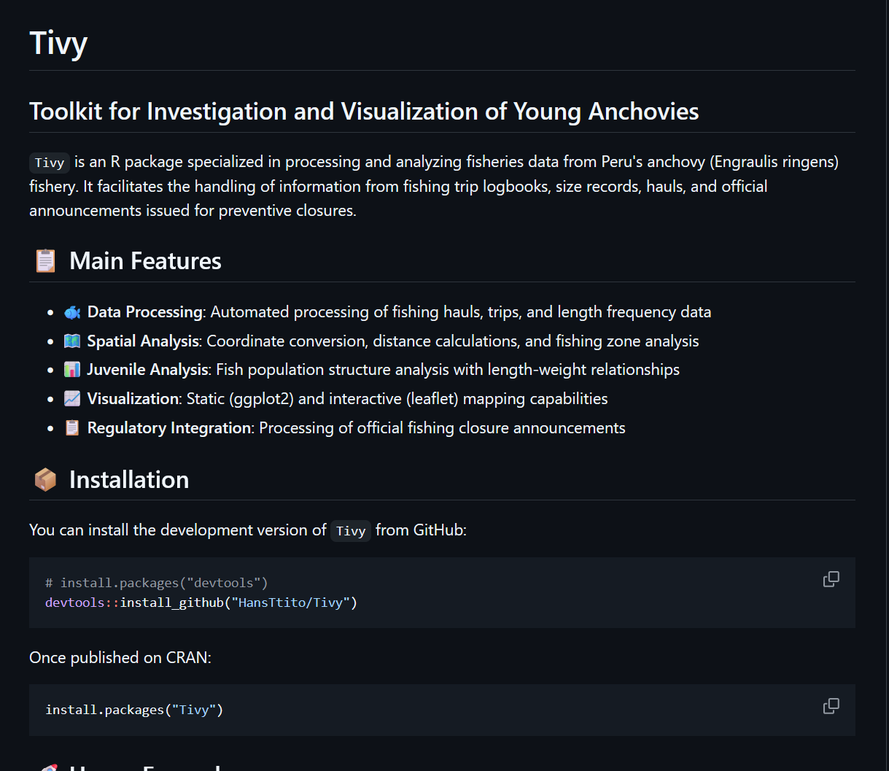

## About this project

**Tivy** (Toolkit for Investigation and Visualization of Young Anchovies) is an R package specialized in processing and analyzing fisheries data from Peru's anchovy (*Engraulis ringens*) fishery. It facilitates the handling of information from fishing trip logbooks, length frequency records, haul data, and official announcements issued by Peru's Ministry of Production for preventive closures.



## Main Features

- **🐟 Data Processing**: Automated processing of fishing hauls, trips, and length frequency data
- **🗺️ Spatial Analysis**: Coordinate conversion, distance calculations, and fishing zone analysis  
- **📊 Juvenile Analysis**: Fish population structure analysis with length-weight relationships
- **📈 Visualization**: Static (ggplot2) and interactive (leaflet) mapping capabilities
- **📋 Regulatory Integration**: Processing of official fishing closure announcements from PRODUCE

## Key Capabilities

- **Biological Indicators**: Calculate juvenile percentages, length-weight relationships, and population metrics
- **Spatial Tools**: Convert DMS coordinates, calculate distances to coast, and analyze fishing zones
- **Data Integration**: Merge logbook data from multiple sources with automated column detection
- **Regulatory Analysis**: Process PDF announcements and visualize fishing closure areas
- **Comprehensive Visualization**: Create publication-ready plots and interactive dashboards

## Target Users

- **Fisheries Researchers**: Analyzing anchovy population dynamics and recruitment
- **Resource Managers**: Monitoring fishing activities and regulatory compliance
- **Data Analysts**: Processing large-scale fishery datasets from Peru
- **Students**: Learning fisheries data analysis and visualization techniques

## How to access

The package is available on [GitHub](https://github.com/HansTtito/Tivy) with comprehensive documentation and examples.

```r
# Install from GitHub
devtools::install_github("HansTtito/Tivy")

# Load and start analyzing
library(Tivy)
```

Soon to be available on CRAN for easier installation.

## Learn More

- 📖 [Package Documentation](https://github.com/HansTtito/Tivy)
- 🐛 [Report Issues](https://github.com/HansTtito/Tivy/issues)
- 📧 Contact: kvttitos@gmail.com

