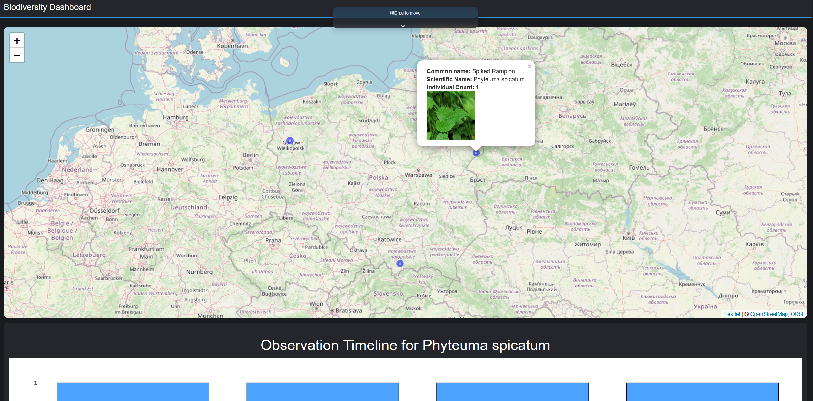

## About this project

This Shiny app allows the visualization of biodiversity species observations in the world. 
Users can search for species by their common or scientific name, and then view their observations on an interactive map. 
They can also explore a timeline showing when the selected species were observed.

## How to access

The application is available on [shinyapps.io](https://kevin-ttito.shinyapps.io/biodiversity-dashboard/).

## Source Code

The source code is available on [GitHub](https://github.com/HansTtito/biodiversity_dashboard).
