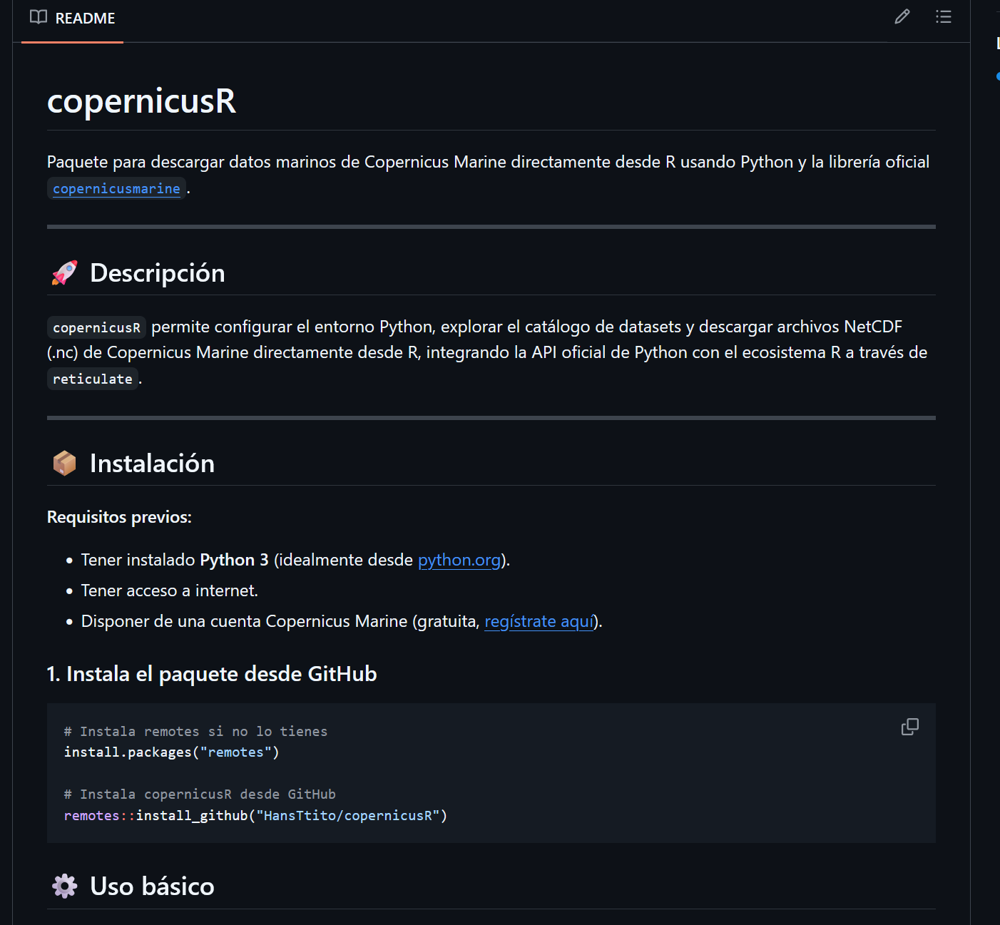

## About this project

copernicusR is an R package that allows you to download, explore, and manage oceanographic data from the Copernicus Marine service directly within R,
using the official Python library copernicusmarine and seamless integration via reticulate.
It's ideal for automating scientific workflows and marine analyses in R across platforms.

## Main Features

- Download oceanographic datasets from Copernicus Marine (CMEMS) directly into R
- Search and filter available datasets by variable, region, or time range
- Simple wrappers for common download and extraction tasks

## How to access

The package is available on [GitHub](https://github.com/HansTtito/copernicusR).

