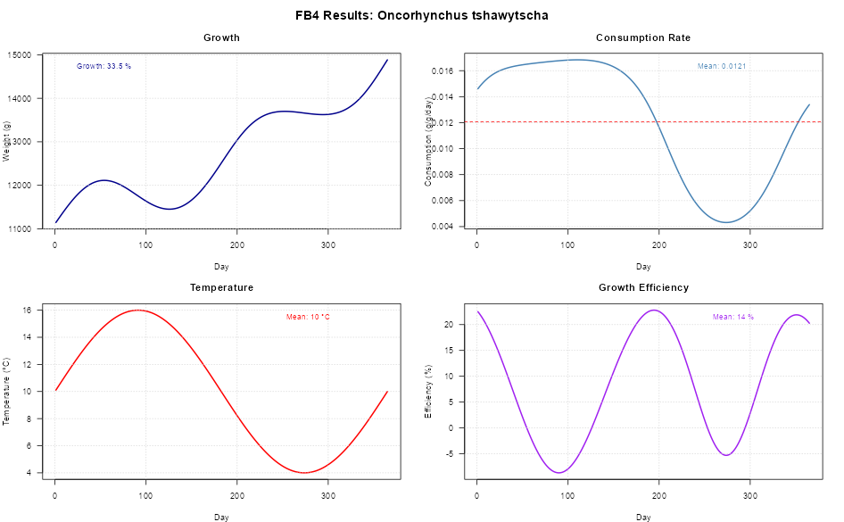

## About this project

I've been working on `fb4package`, an R implementation of the **Fish Bioenergetics 4.0** model developed by Deslauriers et al. (2017).

What started as a need for more flexible fish growth modeling turned into a full package that's way more scriptable than the original Shiny app. Perfect for when you need to run batch simulations or integrate bioenergetic modeling into larger research workflows - and actually reproducible!




## What it does

- **Full energy budget simulations** - Models daily consumption, metabolism, excretion, egestion, and somatic growth  
- **105+ fish species** with pre-loaded parameter sets across various life stages  
- **Automated parameter optimization** - Throw in target weights/consumption and let it optimize  
- **Multi-prey diets** - Because fish don't eat just one thing! Variable daily proportions and indigestible components  
- **Temperature effects** - Realistic seasonal physiology with environmental integration  
- **Actually reproducible** - No more clicking through GUIs! Fully scriptable workflows  

---

## Quick example

```r
library(fb4package)

# Load built-in species parameters
data("fish4_parameters", package = "fb4package")
chinook_params <- fish4_parameters[["Oncorhynchus tshawytscha"]]

# Create temperature data (seasonal variation)
temperature_data <- data.frame(
  Day = 1:365,
  Temperature = 10 + 6 * sin(2 * pi * (1:365) / 365)  # 10°C ± 6°C seasonal cycle
)

# Define diet composition
diet_data <- data.frame(
  Day = 1:365,
  anchoveta = 0.37,  # 37% anchoveta
  sardina = 0.63     # 63% sardina
)

# Prey energy densities (J/g)
prey_energy_data <- data.frame(
  Day = 1:365,
  anchoveta = 5553,
  sardina = 5000
)

# Indigestible fractions
indigestible_data <- data.frame(
  Day = 1:365,
  anchoveta = 0.05,
  sardina = 0.05
)

# Create bioenergetic object
bio_obj <- Bioenergetic(
  species_info = chinook_params$species_info,
  species_params = chinook_params$life_stages$adult,
  environmental_data = list(temperature = temperature_data),
  diet_data = list(
    proportions = diet_data,
    energies = prey_energy_data,
    indigestible = indigestible_data,
    prey_names = c("anchoveta", "sardina")
  ),
  simulation_settings = list(
    initial_weight = 11115.358,  # Initial weight (g)
    duration = 365               # Simulation days
  )
)

# Set predator energy density parameters
bio_obj$species_params <- set_parameter_value(bio_obj$species_params, "ED_ini", 6308.570)
bio_obj$species_params <- set_parameter_value(bio_obj$species_params, "ED_end", 6320.776)

# Run simulation with automatic fitting to target weight
results <- run_fb4(
  bio_obj,
  fit_to = "Weight",
  fit_value = 14883.695,  # Target final weight (g)
  max_iterations = 25
)

# View results
print(paste("Final weight:", round(results$summary$final_weight, 2), "g"))
print(paste("Optimal p-value:", round(results$summary$p_value, 6)))
print(paste("Converged:", results$fit_info$fit_successful))
```

Check it out
Still working on it, but you can explore what's there:
🔗 [https://github.com/HansTtito/fb4package](https://github.com/HansTtito/fb4package)
Feedback welcome! Always looking to improve it and would love to hear what works (or breaks) for you.
Built this because I got tired of manual parameter tweaking - figured others might find it useful too.

Reference
Deslauriers, D., Chipps, S. R., Breck, J. E., Rice, J. A., & Madenjian, C. P. (2017). Fish Bioenergetics 4.0: An R-based modeling application. Transactions of the American Fisheries Society, 146(5), 901–911. https://doi.org/10.1080/03632415.2017.1377558