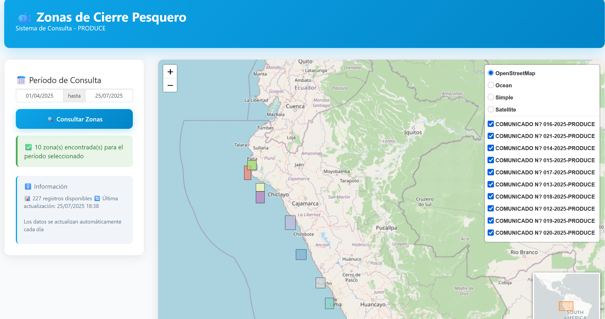

## About this project

This Shiny dashboard provides an interactive visualization of fishing closure zones along the Peruvian coast, based on official announcements from PRODUCE (Ministry of Production). The application automatically processes PDF documents containing fishing restrictions and displays them on an interactive map with temporal filtering capabilities.

## Key Features

- **Dynamic date filtering**: Users can select custom date ranges to view active fishing closures
- **Interactive mapping**: Detailed visualization of closure zones with coordinates and boundaries  
- **Real-time data**: Information sourced directly from official PRODUCE announcements
- **Automated updates**: Data refreshes daily through GitHub Actions integration
- **Responsive design**: Clean, modern interface optimized for both desktop and mobile

## Technical Implementation

The application leverages the **[Tivy](https://github.com/HansTtito/Tivy)** R package to:
- Fetch official announcements from PRODUCE's online system
- Extract geographical coordinates from PDF documents
- Process and format fishing zone boundaries
- Generate interactive maps using Leaflet

Data processing is automated through GitHub Actions, ensuring users always have access to the most recent fishing restrictions without manual intervention.

## How to access

The application is live on [shinyapps.io](https://kevin-ttito.shinyapps.io/fishing-closures-areas-peru/).

## Source Code

The complete source code and automation scripts are available on [GitHub](https://github.com/HansTtito/closures-areas-fishing-peru).

## Impact

This tool serves the Peruvian fishing community by providing easy access to critical regulatory information, helping fishermen stay compliant with current restrictions and supporting sustainable fishing practices along Peru's coastline.