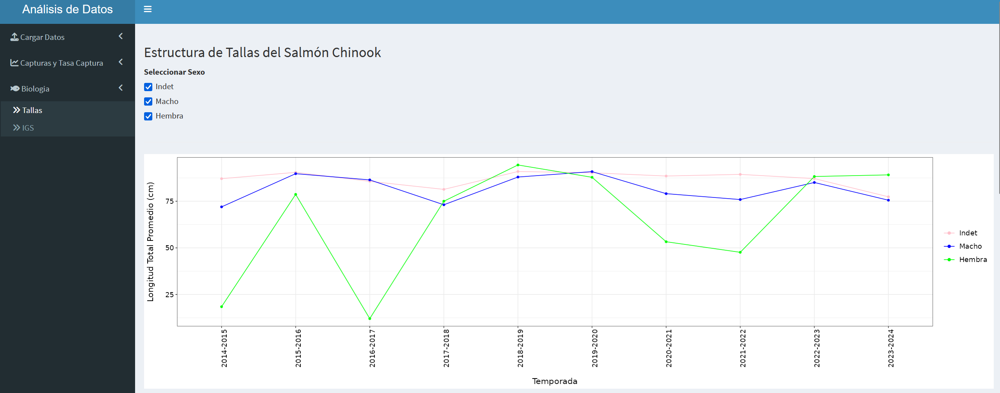

## About this project

This Shiny app was developed to provide an interactive interface for exploring data collected by [Invasal](https://invasal.cl/), an initiative focused 
on monitoring invasive salmonid species in Chile.
The app enables users to visualize catch records and biological information, such as size and GSI, across different regions and time periods.

## How to access

The application is available on [shinyapps.io](https://kevin-ttito.shinyapps.io/invasal/).

## Source Code

The source code is available on [GitHub](https://github.com/HansTtito/invasal).
