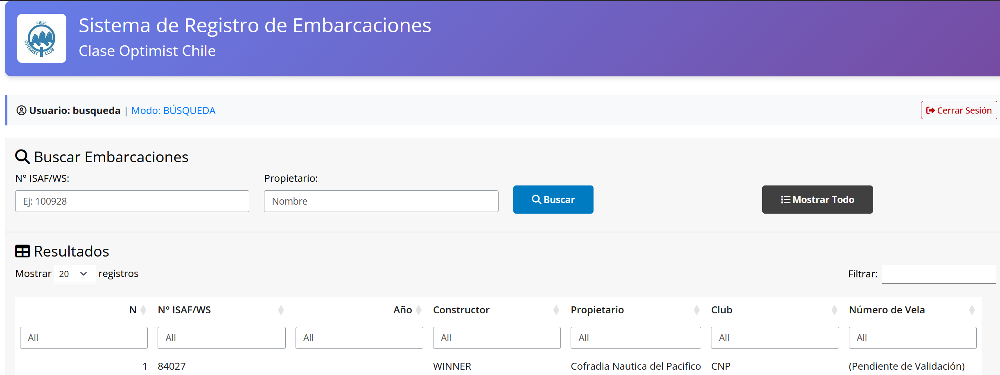

## About this project

This Shiny application provides a complete registration and management system for Optimist class sailing vessels in Chile, featuring a three-tier validation workflow.

**Key features:**

- **Registration**: Users can register new vessels (ISAF/WS number, owner, club, etc.)
- **Validation**: Approval system that automatically assigns consecutive sail numbers
- **Search**: Query vessels by ISAF/WS number or owner name
- **Security**: Authentication system with three differentiated roles (register, validate, search)
- **Database**: Parquet format storage with 233+ historical records

## How to access

The application is available at [shinyapps.io](https://kevin-ttito.shinyapps.io/barcos-optimis/).

**Demo credentials:**
- Register: `registro` / `registro123`
- Validate: `validacion` / `validacion123`
- Search: `busqueda` / `busqueda123`

## Source Code

The source code is available on [GitHub](https://github.com/HansTtito/usuarios-vela).

## Technologies

- **Shiny**: Interactive web framework in R
- **shinymanager**: User authentication
- **Apache Arrow**: Efficient Parquet storage
- **DT**: Interactive tables
- **dplyr**: Data manipulation
