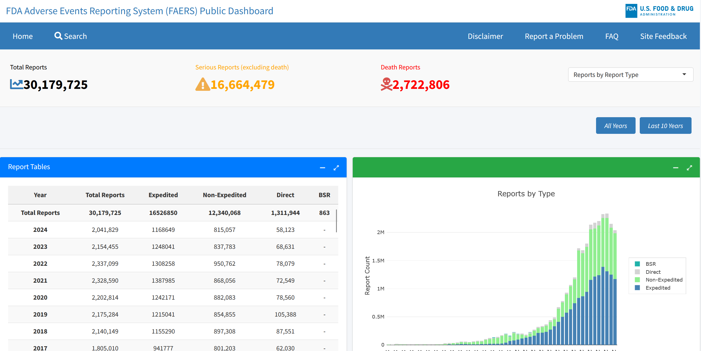

## About this project

This web application was developed as part of the Hackathon organized by [Appsilon](https://www.appsilon.com/)

## How to access

The application is available on [shinyapps.io](https://kevin-ttito.shinyapps.io/shiny-tiny-hackathon/).

## Source code

The source code is available on [GitHub](https://github.com/HansTtito/shiny-tiny-hackathon).
